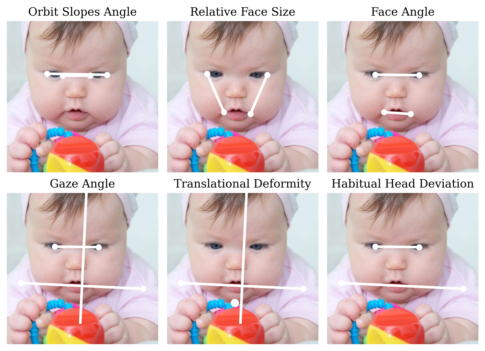
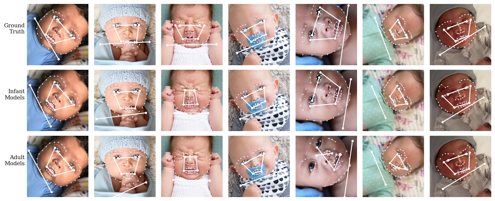
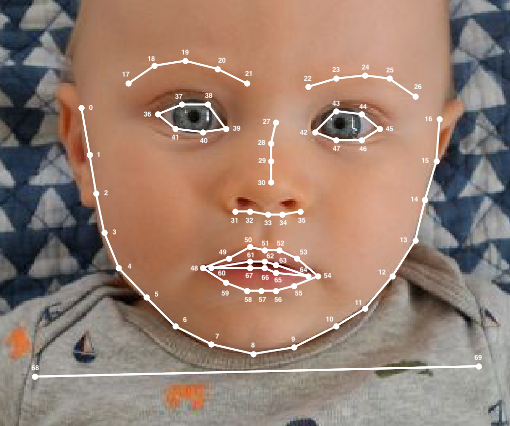
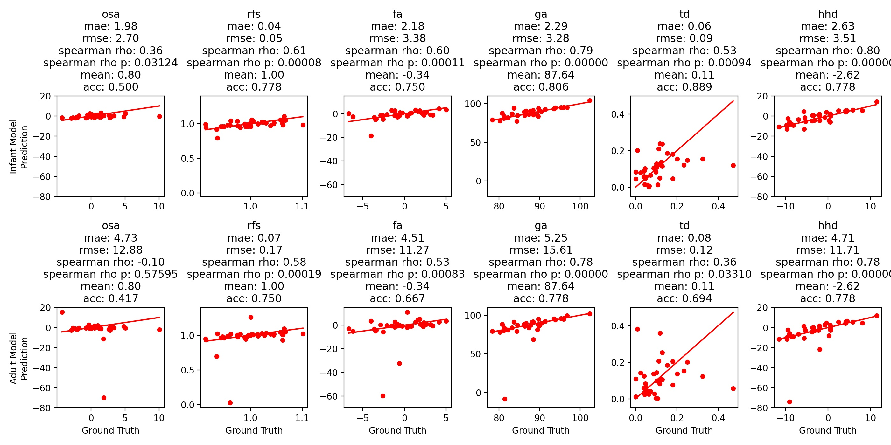

# Automatic Assessment of Infant Face and Upper-Body Symmetry as Early Signs of Torticollis

**Note:** This repository is intended to be used by computer vision practitioners, but we hope the results and techniques will be of interest to a wider audience as well, including researchers or clinicians in pediatric health and development. As such, we encourage those interested in working with our data or models to get in touch with our lab, [Augmented Cognition Lab](https://web.northeastern.edu/ostadabbas/), at <ostadabbas@ece.neu.edu>, to discuss opportunities for collaboration.

## Introduction 
This is the official repository for:

Wan, M., Huang, X., Tunik, B., & Ostadabbas, S.  "Automatic Assessment of Infant Face and Upper-Body Symmetry as Early Signs of Torticollis." *The 17th IEEE International Conference on Automatic Face and Gesture Recognition, Workshop on Artificial Intelligence for Automated Human Health-care and Monitoring* (AI4Healthcare @ FG 2023). [[arXiv link]()]

In this paper, we apply computer vision pose estimation techniques developed expressly for the data-scarce infant domain to the study of torticollis, a common condition in infants and children characterized by a persistent neck tilt or twist to one side. Specifically, we study six geometric measurements of symmetry derived from the pediatric physical therapy and ophthalmology research literature, illustrated here:

<div align="center">

</div>

Our paper makes use of the [InfAnFace](https://github.com/ostadabbas/Infant-Facial-Landmark-Detection-and-Tracking) dataset of infant faces with facial landmark labels, which we supplement with additional shoulder landmark labels. We employ two facial landmark estimation models, also from the InfAnFace repository: HRNet-R90JT, which is specifically designed for the infant domain, and HRNet, designed for a largely adult domain. We also use two body pose (skeleton) estimation models, from the [FiDIP](https://github.com/ostadabbas/Infant-Pose-Estimation) repository: the FiDIP model, specifically designed for infants, and the DarkPose model, designed largely for adults. The following illustrates predictions of some of the geometric quantities used to define our measurements of symmetry:

<div align="center">

</div>

We first describe how to reproduce the performance evaluations described in our paper, based on the ground truth and pose estimation predictions of the face and shoulder landmarks from the models listed above. Then we go back and explain how these predictions can be obtained from their respective repositories.

## Licence

By downloading or using any of the datasets provided by the ACLab, you are agreeing to the “Non-commercial Purposes” condition. “Non-commercial Purposes” means research, teaching, scientific publication and personal experimentation. Non-commercial Purposes include use of the Dataset to perform benchmarking for purposes of academic or applied research publication. Non-commercial Purposes does not include purposes primarily intended for or directed towards commercial advantage or monetary compensation, or purposes intended for or directed towards litigation, licensing, or enforcement, even in part. These datasets are provided as-is, are experimental in nature, and not intended for use by, with, or for the diagnosis of human subjects for incorporation into a product.

Users of this repository must abide by the respective licenses of any code included from other sources.

## Data and model performance evaluations

The `landmarks.csv` file contains all of the data analyzed in the paper, namely:

* filenames of the subset of InfAnFace chosen for our analysis,
* metadata inherited from InfAnFace, such as pose attribute labels,
* 70 2D landmark coordinates (68 for the face and 2 for the shoulders) from:
    * `gt`: the ground truth (68 face coordinates from InfAnFace and 2 shoulder coordinates newly labeled by us),
    * `infant`: infant specific pose estimation models, and
    * `adult`: general (largely adult) pose estimation models.

The images themselves can be found at the [InfAnFace](https://github.com/ostadabbas/Infant-Facial-Landmark-Detection-and-Tracking) repository. The enumeration of the landmark labels is as depicted here:

<div align="center">

</div>

The performance of each pose estimation paradigm (infant domain or adult domain) in the prediction of each geometric measure of symmetry (osl: orbit slopes angle, rfs: relative face size, fa: facial angle, ga: gaze angle, td: translational deformity, and hhd: habitual head deviation) can be obtained with 

````
python eval.py
````

The evaluation script `eval.py` computes each geometric measure of symmetry for each infant face, and also the resulting performance metrics per pose estimation model. The code is not sophisticated and depends only on popular, stable packages. It outputs results in text form and the following scatter plots:

<div align="center">

</div>

## Face and body pose estimation models

Inference is performed on the images in the [InfAnFace](https://github.com/ostadabbas/Infant-Facial-Landmark-Detection-and-Tracking) dataset, specifically, the subset listed in `landmarks.csv`.

Facial landmark estimation predictions are obtained from the pretrained models in the InfAnFace repository. Specifically, the `HRNet-R90JT` model is used to represent infant-domain-specific facial landmark estimation, and `HRNet` is used to represent the adult-domain estimation, and these inference results can be reproduced by following Steps 1-3 and 11-12 [here](https://github.com/ostadabbas/Infant-Facial-Landmark-Detection-and-Tracking#facial-landmark-estimation-models). The latter model is effectively the same as the official default pretrained [HRNet](https://github.com/HRNet/HRNet-Facial-Landmark-Detection) model (for face landmark estimation). 

Body joint pose estimation (or skeleton estimation) uses pretrained models from the [FiDIP](https://github.com/ostadabbas/Infant-Pose-Estimation) repository. The `hrnet_fidip` model is used for infant estimation, and the DarkPose (HRNet-W48, 384x288) `coco/w48_384x288` model is used for adult estimation, with the latter taken from [DarkPose](https://github.com/ilovepose/DarkPose). FiDIP requires body bounding boxes for inference, which we obtained from [this](https://github.com/eriklindernoren/PyTorch-YOLOv3) PyTorch implementation of YOLOv3.

## Citation
Here is a BibTeX entry for our preprint:
````
@inproceedings{WanTorticollis2022,
  title={Automatic Assessment of Infant Face and Upper-Body Symmetry as Early Signs of Torticollis},
  author={Michael Wan and Xiaofei Huang and Bethany Tunik and Sarah Ostadabbas},
  booktitle = {Submittted},
  year={2022}
}
````
